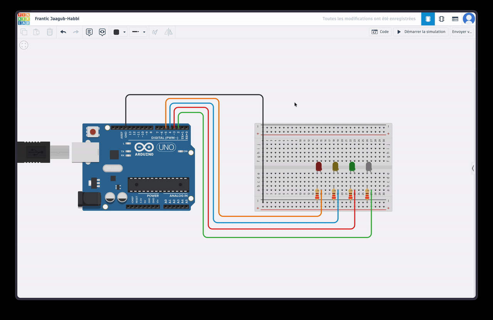
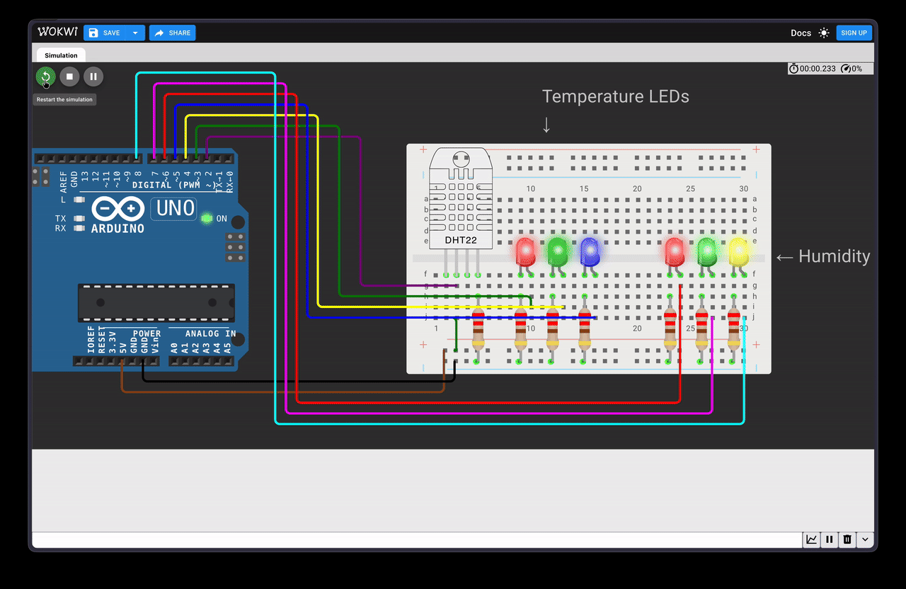

# ETNA ThermOS

**ETNA ThermOS** is a smart weather station based on Arduino. This project was carried out as part of the **Introduction to the IOT** module at ETNA. It measures ambient temperature and humidity using a DHT11 sensor, displays the data on an LCD screen, and provides dynamic visual indicators (LEDs) depending on the conditions.

## Features

The project was developed step by step, covering the following features:

### 1. LED and Analog Input Control

- **Flashing scenarios:** LEDs in parallel, running lights, and alternating flashing.
- **Speed control:** Use of a potentiometer to vary the flashing speed in real time.

---

### 2. Data Acquisition and Display

- **DHT11 sensor:** Reading of temperature (°C) and humidity (%).
- **Serial monitor:** Raw display for debugging.
- **I2C LCD screen:** Formatted display of values in real time.

---

### 3. Conditional Logic (Indicator Lights)

The system alerts the user via a specific color code:

- **Temperature:**
  - 🟦 < 10°C (Cold)
  - 🟩 15°C - 20°C (Ideal)
  - 🟥 > 22°C (Hot)
- **Humidity:**
  - 🟨 < 30% (Dry)
  - 🟦 30% - 60% (Comfortable)
  - 🟥 > 70% (Humid)

---

### 4. Advanced Effects & Interface

- **LED progress bar:** Visual simulation of a thermometer (the LEDs light up gradually as the temperature rises).
- **Dynamic alerts:** Alert messages on the LCD screen if critical thresholds are exceeded.

---

### Implemented Bonuses

- [x] **Bonus 1:** “Breathing” effect (fade in/out) on LEDs via PWM.
- [x] **Bonus 3:** Use of a push button to interact with the system (e.g., mode change or reset).
- [x] **Bonus 5:** Advanced multicolor running light.

## Equipment Used

- Arduino UNO board
- DHT11 temperature/humidity sensor
- 16x2 LCD screen (I2C interface)
- LEDs (Red, Green, Blue, Yellow)
- Resistors (220Ω, 10kΩ)
- Breadboard and jumper cables

## Installation and Use

1.  **Prerequisites:** Have the Arduino IDE installed.
2.  **Required libraries:**
    - `DHT sensor library` (by Adafruit)
    - `LiquidCrystal I2C` (by Frank de Brabander)
3.  **Assembly:** Refer to the wiring diagrams included in each step folder.
4.  **Launch:**
    - Open the `.ino` file corresponding to the desired step.
    - Select the correct COM port and board type (Arduino Uno).
    - Upload the program.

---

_Project realized for the Introduction to the IOT module - ETNA._
